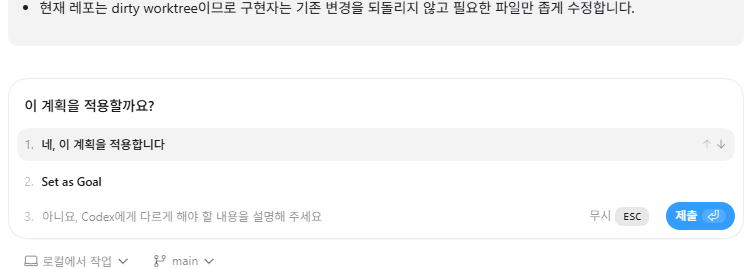
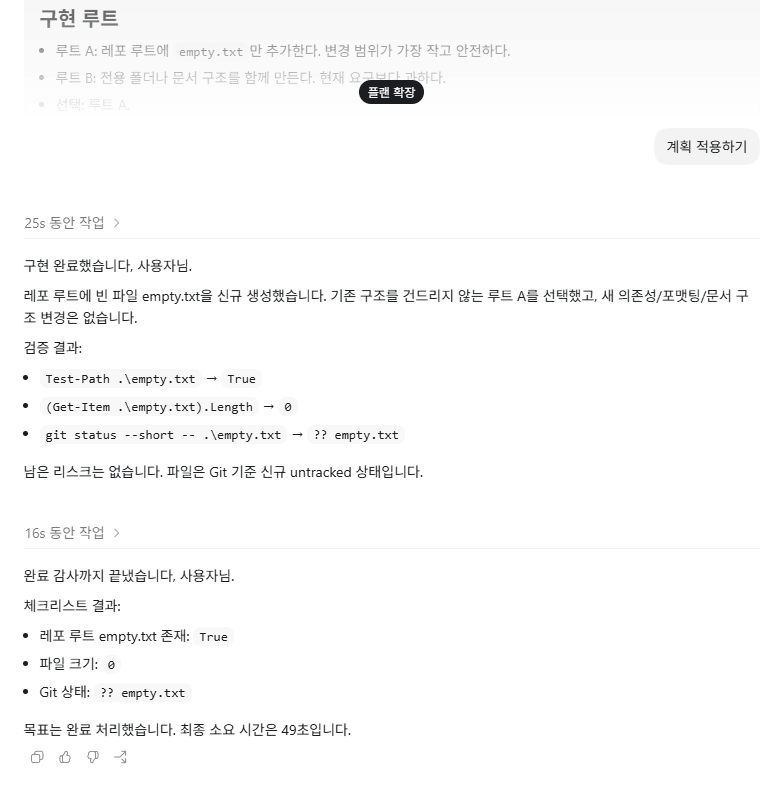

# CodexPatched Public Patch

Public release package for the current Codex Desktop app.

This package starts from the latest installed official Codex app and patches only public UI behavior:

- show the official `/goal` slash command in the composer popup when `[features] goals = true`
- add `Set as Goal` to the plan implementation prompt
- add an in-app browser address-bar button that opens the current browser page in a mini window
- keep the Microsoft Store Codex app untouched by patching a separate `CodexPatched` copy

Private runtime payloads are not included in this repository.

## Run

```powershell
python .\scripts\apply_codexpatched_public.py --sync-from-source
```

## Dry Run

```powershell
python .\scripts\apply_codexpatched_public.py --dry-run
```

## Goal Config

The official app still owns Goal execution. Enable it in `%USERPROFILE%\.codex\config.toml`:

```toml
[features]
goals = true
```

This patch removes only the renderer-side Statsig popup gate. It does not replace the official Goal route, editor, pause, delete, or trace behavior.

## Legacy Public README


Unofficial local patch bundle for the Codex desktop app. It fixes the `/goal` workflow, adds a project path retarget action for moved local folders, and repairs common patched-app `browser-use` wiring issues.

This repository does not include OpenAI binaries, `app.asar`, extracted application files, user profiles, tokens, or cache files. Users apply the patch to their own local Codex installation at their own risk.

## Latest Update

The initial release added the missing desktop UI wiring for Codex goals: `/goal <objective>` appears in the local composer, calls Codex's persisted `thread/goal/set` API, and lets Codex's own goal runtime keep working until the goal is complete, paused, budget-limited, or stopped.

This update keeps that real goal behavior and adds the install-time pieces needed on current Codex desktop builds: the installer enables `[features].goals = true` automatically in `%USERPROFILE%\.codex\config.toml`, preserves existing TOML sections, repairs stale local goal-runtime state, supports the current minified bundle names, and resumes the thread after setting the goal so Codex's continuation runtime starts even when the desktop view had not loaded the thread yet.

The Plan Mode follow-up prompt now also has a **Set as Goal** option. It does not hardcode any objective: by default the completed plan itself becomes the Goal objective, and when the plan includes an explicit ``/goal ...`` draft the patched app extracts that objective instead. Normal **Yes, implement this plan** behavior is unchanged, and arbitrary freeform replies are not treated as Goal unless they are explicitly written as `/goal <objective>`.

In localized Codex builds, the rendered implementation message can appear as the local "Implement plan" label, such as `계획 적용하기` in Korean. That is only display text; the actual model input still uses Codex's normal `PLEASE IMPLEMENT THIS PLAN:` wrapper plus the completed plan content.

## Release Model

Releases are cumulative. Install the latest release ZIP only; you do not need to apply older patch releases in order. The installer copies the current official Codex desktop app into `%LOCALAPPDATA%\OpenAI\CodexPatched\app` and applies every supported patch in this repository to that copy.

When Codex itself updates, download the latest patch release again and run:

```powershell
.\install_windows.ps1 -Force
```

`-Force` replaces the existing `CodexPatched` copy with a fresh copy of the current official app, then reapplies the latest cumulative patch. Your official Codex install remains untouched.

Codex desktop updates can still break patch anchors because this project edits minified Electron bundles. The patch is designed to handle most small bundle-name and code-shape changes through multiple anchors and idempotent cleanup paths, but it intentionally fails closed when a required pattern cannot be matched exactly. A failed match means the patch script needs an update for that Codex build; do not force or hand-edit around it.

Installer note: current releases repack `app.asar` to a new file and then replace the old archive. This matters because Electron's `asar pack` command can return success without overwriting an existing archive on some Windows/AppX copied files.

## Screenshots

The screenshots show the important behaviors this patch is meant to provide:

1. **Project path menu**: the local project sidebar menu includes **Change project folder** / **프로젝트 경로 변경**. Use this when a project folder moved and you want existing chats to keep using the new `cwd`.
2. **`cwd` retarget proof**: after using the project path action, the same chat reports a different current working directory, showing that the saved workspace path changed from the old folder to the new one.
3. **`/goal` slash command**: typing `/goal` in the composer opens the Goal slash command entry.
4. **Goal set confirmation**: after submitting `/goal <objective>`, the app shows **Goal set**, confirming that the thread goal was accepted.
5. **Plan Mode Set as Goal choice**: a completed Plan Mode proposal shows **Set as Goal** beside the normal implementation choice.
6. **Plan Mode Goal run**: after choosing **Set as Goal**, Codex starts the normal plan implementation path and the built-in Goal runtime performs the completion audit.


```The chat output shows that the active `cwd` changes after retargeting the project path.```


```The composer recognizes `/goal` as a slash command.```


```The "Goal set" toast confirms that the goal was applied.```





```A completed plan can be applied normally or promoted to a Goal with Set as Goal.```





```Plan Mode's Set as Goal option starts implementation, then Goal continuation audits and completes the objective.```


## Plain User Guide

This is a Windows-only patch installer for people who already have the Codex desktop app installed. It is tested on Windows 11, and should also work on Windows systems that use the same Codex desktop app layout.

It does not give you a modified Codex installer. Instead, it copies your own local Codex app into a separate folder, patches that copy, and leaves the original app installed.

After installing, use:

```text
%LOCALAPPDATA%\OpenAI\CodexPatched\app\Codex.exe
```

It is normal if `%LOCALAPPDATA%\OpenAI` does not exist before running the installer. The installer creates `%LOCALAPPDATA%\OpenAI\CodexPatched` for the patched copy.

Some official Codex installs live under `%LOCALAPPDATA%\Programs\Codex`. Store/AppX installs can also live under a versioned WindowsApps path such as:

```text
C:\Program Files\WindowsApps\OpenAI.Codex_26.429.3425.0_x64__2p2nqsd0c76g0\app\Codex.exe
```

The installer checks these locations automatically. If auto-detection fails, pass the full `Codex.exe` path with `-SourceApp`.

You can tell non-technical users this:

```text
Install the official Codex desktop app first. Then install Python 3.11+ and Node.js LTS if you do not already have them.

Download the latest release ZIP from the Releases page, extract it, close Codex completely, open PowerShell in the extracted folder, and run:

Set-ExecutionPolicy -Scope Process Bypass
.\install_windows.ps1

When it finishes, launch:
%LOCALAPPDATA%\OpenAI\CodexPatched\app\Codex.exe

Use /goal your goal text in a loaded local Codex chat to set or replace the active thread goal. For anything nontrivial, write the goal in a separate note or editor first, then paste it after `/goal`; keeping that source copy makes the original objective easier to review after Codex finishes the goal run. Codex uses its built-in goal continuation runtime to start or continue work until the goal is marked complete, paused, budget-limited, or stopped. On the new-chat home screen, `/goal <objective>` queues that goal for the next local chat you start from the same project.
After Plan Mode finishes a plan, you can choose **Set as Goal** instead of **Yes, implement this plan**. The patched app sets the completed plan as the Goal objective, starts implementation through Codex's normal plan-implementation path, and then lets the built-in Goal runtime continue/audit the work. If the plan contains a `/goal <objective>` draft, that explicit objective is used instead.
If you moved a project folder, right-click that project in the sidebar and choose Change project folder / 프로젝트 경로 변경. Select the new folder location. This keeps the chat history and retargets the cwd/workspace path Codex uses.

If the installer cannot find Codex, find the official Codex.exe path and run the installer again with -SourceApp. For Store/AppX installs the path may look like:
.\install_windows.ps1 -SourceApp "C:\Program Files\WindowsApps\OpenAI.Codex_26.429.3425.0_x64__2p2nqsd0c76g0\app\Codex.exe"
```

If a patched copy already exists, run:

```powershell
.\install_windows.ps1 -Force
```

To install and launch the patched app in one step:

```powershell
.\install_windows.ps1 -Launch
```

## What This Fixes

- `/goal <objective>` can be entered from the composer.
- `/goal <objective>` in an existing loaded local thread sets the active thread goal through Codex's `thread/goal/set` API and lets the real goal runtime start/continue work automatically.
- `/goal <objective>` appears on the new-chat home composer. If no thread exists yet, the goal is queued and applied to the next local chat created from that project.
- Plan Mode's completed-plan prompt includes **Set as Goal** in addition to the normal implementation choice.
- **Set as Goal** uses the completed plan as the Goal objective, extracts an explicit `/goal <objective>` from the plan when present, starts the normal plan implementation path, and lets Codex's built-in Goal runtime continue/audit the work.
- Other/freeform Plan Mode replies remain normal user input unless the user explicitly types `/goal <objective>`.
- The installer enables the local Codex `goals` feature flag in `%USERPROFILE%\.codex\config.toml`.
- The installer repairs stale local goal-runtime backfill state that can block Codex from opening its goal continuation database.
- Setting a new goal first clears the previous thread goal, so a completed or stale goal does not block the next one.
- Local project sidebar menu gets **Change project folder** / **프로젝트 경로 변경**.
- When a project folder was moved, the app can retarget existing chats to the new folder path instead of treating the old path as permanently missing.
- Existing chats keep their session history while their saved `cwd` is updated to the new folder.
- `browser-use` is configured to trust the patched app's bundled browser client when `node_repl` is launched from the patched copy.
- `browser-use` can recover the registered conversation/window route when the app missed a per-turn IAB route capture.
- During `browser-use` control, simple website `alert()` popups are suppressed so native OK-only dialogs do not block automation. `confirm()` and `prompt()` are left unchanged.
- Electron ASAR integrity in `Codex.exe` can be updated after repacking `app.asar`.

## About `cwd` and Moved Folders

`cwd` means current working directory. In Codex, each local chat is tied to a project folder path. That path decides where shell commands run and which workspace the chat sees.

If you move a project folder, old chats can still point at the old path. The patched app adds **Change project folder** / **프로젝트 경로 변경** so you can choose the new location for that existing project.

The retarget action updates Codex's saved local state for matching chats:

- `state_5.sqlite` thread `cwd` values.
- Matching session JSONL `payload.cwd` values.
- Saved sidebar/workspace root state in `.codex-global-state.json`.

The retarget action does not:

- Delete chats.
- Create new replacement chats.
- Move files or folders on disk.
- Change unrelated projects.

Before writing changes, it creates a backup under:

```text
%USERPROFILE%\.codex\backups\cwd-retarget-*
```

## Important Notes

- This is not an official OpenAI project.
- This repository is source-only. It does not redistribute Codex binaries or a prepatched app.
- Do not publish or redistribute `Codex.exe`, `app.asar`, extracted app bundles, `.codex` profiles, auth files, logs, or caches.
- The patched app is installed as a separate copy named `CodexPatched`. Your official Codex install remains available.
- Latest releases are cumulative. Use the newest release ZIP only; do not apply old releases one by one.
- Codex updates can change the minified bundle names and code patterns. If the script cannot find exactly one match, it stops instead of guessing.
- Patch a copied app directory, not your only Codex install.
- The project path action does not move folders on disk. It only updates Codex's saved workspace path for matching local chats.

## Requirements

- Windows Codex desktop app installed.
- Python 3.11 or newer.
- Node.js/npm for `npx @electron/asar`.

The installer auto-detects common Codex desktop install locations, including:

```text
%LOCALAPPDATA%\OpenAI\Codex\app
%LOCALAPPDATA%\Programs\Codex
%PROGRAMFILES%\Codex
%PROGRAMFILES%\OpenAI\Codex
C:\Program Files\WindowsApps\OpenAI.Codex_*\app
```

It also checks Codex-looking folders under `%LOCALAPPDATA%\Programs`, `%LOCALAPPDATA%\OpenAI`, Program Files, Windows uninstall registry entries, and AppX/MSIX package installs such as `OpenAI.Codex`. If `Get-AppxPackage` is unavailable, the installer still tries the direct WindowsApps folder pattern.

The patched copy is always created at:

```text
%LOCALAPPDATA%\OpenAI\CodexPatched\app
```

## Easy Install

1. Open the latest GitHub Release and download `codex-desktop-patch-*.zip`.
2. Extract the ZIP.
3. Close Codex completely.
4. Open PowerShell in the extracted folder.
5. Run:

```powershell
Set-ExecutionPolicy -Scope Process Bypass
.\install_windows.ps1
```

If you already installed a patched copy and want to replace it:

```powershell
.\install_windows.ps1 -Force
```

Use `-Force` after Codex desktop updates too. It rebuilds the patched copy from the latest official app plus the current cumulative patch; there is no sequential patch chain.

If you want the installer to open the patched app when it finishes:

```powershell
.\install_windows.ps1 -Launch
```

If your Codex app is installed in a nonstandard folder:

```powershell
.\install_windows.ps1 -SourceApp "C:\Path\To\Codex\app"
```

`-SourceApp` may point at either the app folder, `Codex.exe`, or `resources\app.asar`:

```powershell
.\install_windows.ps1 -SourceApp "C:\Program Files\WindowsApps\OpenAI.Codex_26.429.3425.0_x64__2p2nqsd0c76g0\app\Codex.exe"
```

If the app is already patched but `browser-use` still points at an old app copy:

```powershell
.\install_windows.ps1 -RepairBrowserUseOnly
```

The installer creates a separate patched copy at:

```text
%LOCALAPPDATA%\OpenAI\CodexPatched\app\Codex.exe
```

## Recommended Layout

The commands below create a separate patched app copy:

- Original app: `%LOCALAPPDATA%\OpenAI\Codex\app`
- Patched copy: `%LOCALAPPDATA%\OpenAI\CodexPatched\app`

Close Codex before patching. The easy installer above does these steps automatically. The manual commands below are kept for troubleshooting.

## Manual Install

Run PowerShell from this repository directory.

```powershell
$src = "$env:LOCALAPPDATA\OpenAI\Codex\app"
$dstRoot = "$env:LOCALAPPDATA\OpenAI\CodexPatched"
$dst = "$dstRoot\app"
$extract = "$env:TEMP\codex-desktop-patch-app-asar"

New-Item -ItemType Directory -Force $dstRoot | Out-Null
Copy-Item -Recurse -Force $src $dst

Copy-Item "$dst\resources\app.asar" "$dst\resources\app.asar.original-codexpatch"
Copy-Item "$dst\Codex.exe" "$dst\Codex.exe.original-codexpatch"

Remove-Item -Recurse -Force $extract -ErrorAction SilentlyContinue
npx --yes @electron/asar extract "$dst\resources\app.asar" $extract

py -3 .\codex_desktop_patch.py $extract

$newAsar = "$dst\resources\app.asar.codexpatch-new"
Remove-Item -Force $newAsar -ErrorAction SilentlyContinue
npx --yes @electron/asar pack $extract $newAsar
attrib -R "$dst\resources\app.asar"
Remove-Item -Force "$dst\resources\app.asar"
Move-Item -Force $newAsar "$dst\resources\app.asar"

attrib -R "$dst\Codex.exe"
py -3 .\codex_desktop_patch.py --fix-integrity $dst

.\install_windows.ps1 -RepairBrowserUseOnly -SourceApp $dst
```

If `py -3` is not available, use `python`:

```powershell
python .\codex_desktop_patch.py $extract
python .\codex_desktop_patch.py --fix-integrity $dst
.\install_windows.ps1 -RepairBrowserUseOnly -SourceApp $dst
```

## Run

```powershell
& "$env:LOCALAPPDATA\OpenAI\CodexPatched\app\Codex.exe"
```

If the official Codex app is already running, close it first. Electron may forward launches to the already-running instance.

The installer prints the exact path to the patched `Codex.exe` when it succeeds.

## Verify

For `/goal`, in a local Codex thread:

1. Type `/goal test goal one`.
2. Confirm the app reports that the goal was set.
3. Confirm Codex starts or continues through the goal runtime.
4. Type `/goal test goal two`.
5. The second goal should replace the previous one instead of failing because a goal already exists.

For real work, draft the full goal somewhere outside Codex first and paste it into `/goal`. That keeps the exact objective easy to find later when reviewing a completed run.

For `/goal` from the new-chat home screen:

1. Select a local project.
2. Type `/goal test goal from home`.
3. Confirm the app queues the goal for the next chat.
4. Send the first real task message in that project.
5. Confirm the new chat starts and the queued goal is applied.

For moved project folders:

1. Launch the patched Codex copy.
2. Right-click a local project in the sidebar.
3. Click **Change project folder** or **프로젝트 경로 변경**.
4. Select the folder's new location.
5. The patch updates the sidebar project path, matching local thread cwd values, and session metadata. A backup is written under `%USERPROFILE%\.codex\backups\cwd-retarget-*`.

This keeps the existing chats. It changes the workspace path those chats use. It does not delete sessions and does not move project files.

For `browser-use`:

1. Launch the patched Codex copy.
2. Start a local thread in the patched app.
3. Ask Codex to open or inspect a local page with browser-use.
4. The `iab` backend should connect through the patched app's bundled browser client.
5. If the app missed a per-turn IAB route capture, the patched app should recover the registered route for the same conversation/window instead of failing with a route capture error.
6. OK-only website alerts should not block browser-use while the agent is controlling the browser.

## Restore

Close Codex, then restore the backed-up files. The easy installer writes timestamped backups next to the patched files:

```text
%LOCALAPPDATA%\OpenAI\CodexPatched\app\Codex.exe.original-codexpatch-*
%LOCALAPPDATA%\OpenAI\CodexPatched\app\resources\app.asar.original-codexpatch-*
```

For manual installs using the commands above, restore the fixed backup names:

```powershell
$dst = "$env:LOCALAPPDATA\OpenAI\CodexPatched\app"
Copy-Item "$dst\resources\app.asar.original-codexpatch" "$dst\resources\app.asar" -Force
Copy-Item "$dst\Codex.exe.original-codexpatch" "$dst\Codex.exe" -Force
```

Or delete `%LOCALAPPDATA%\OpenAI\CodexPatched` and keep using the official Codex install.

## Troubleshooting

### `expected 1 match, found 0`

The Codex desktop app bundle changed. Do not force the patch. Update the script for that Codex version.

### `Integrity check failed for asar archive`

Run:

```powershell
py -3 .\codex_desktop_patch.py --fix-integrity "$env:LOCALAPPDATA\OpenAI\CodexPatched\app"
```

### `/goal` does not appear

Make sure you launched the patched copy, not the official app. Close all Codex processes and launch:

```powershell
& "$env:LOCALAPPDATA\OpenAI\CodexPatched\app\Codex.exe"
```

### Project path change does not appear

Make sure you launched the patched copy. The project path action only appears for local workspace projects in the project action menu.

### Project path change fails

Check `%USERPROFILE%\.codex\backups` first. The retarget action backs up `state_5.sqlite`, its WAL/SHM sidecars when present, `.codex-global-state.json`, and affected rollout JSONL files before writing changes.

### `%LOCALAPPDATA%\OpenAI` does not exist

That can be normal before installation. The installer creates `%LOCALAPPDATA%\OpenAI\CodexPatched` for the patched app copy.

If the installer says it cannot find Codex, the official app is probably installed somewhere else or only the Codex CLI is installed. Find the folder that contains both `Codex.exe` and `resources\app.asar`, then run:

```powershell
.\install_windows.ps1 -SourceApp "C:\Path\To\Codex\app"
```

If Codex is installed from an AppX/MSIX package, the path can look like:

```text
C:\Program Files\WindowsApps\OpenAI.Codex_26.429.3425.0_x64__2p2nqsd0c76g0\app\Codex.exe
```

That full `Codex.exe` path is valid for `-SourceApp`:

```powershell
.\install_windows.ps1 -SourceApp "C:\Program Files\WindowsApps\OpenAI.Codex_26.429.3425.0_x64__2p2nqsd0c76g0\app\Codex.exe"
```

### `browser-use` says no Codex IAB backends were discovered

If a Node REPL reset fixes it, the app bundle is usually not broken. The current `node_repl` process lost the in-app browser discovery state.

Run:

```powershell
.\install_windows.ps1 -RepairBrowserUseOnly
```

This rewrites `%USERPROFILE%\.codex\config.toml` so `node_repl` trusts the browser-use client shipped inside `%LOCALAPPDATA%\OpenAI\CodexPatched\app`. It does not stop running `node_repl.exe` processes by default, because doing that can interrupt active browser-use sessions.

If you are sure no active session is relying on browser-use and you want to clean stale patched `node_repl.exe` processes too, run:

```powershell
.\install_windows.ps1 -RepairBrowserUseOnly -StopNodeRepl
```

Retry browser-use after that. If the same error persists, reset Node REPL or fully close and reopen Codex.

Current versions of this patch also include desktop-app IAB route recovery for cases where Codex has already registered a browser route for the same conversation. If you still see the same error after reinstalling with `.\install_windows.ps1 -Force`, verify that you launched `%LOCALAPPDATA%\OpenAI\CodexPatched\app\Codex.exe`, not the official unpatched app.

### `browser-use` says no browser route was captured

If `setupAtlasRuntime({ backend: "iab" })` succeeds but opening a tab fails with an error like this:

```text
No Codex browser route captured for browser session ... turn ...
```

Install the latest patch with:

```powershell
.\install_windows.ps1 -Force
```

Then fully close Codex and launch the patched app again. This version can recover the registered conversation/window route when Codex missed the per-turn browser route capture.

### Website alert popups block `browser-use`

Install the latest patch with:

```powershell
.\install_windows.ps1 -Force
```

Then fully close and reopen the patched app. The patch suppresses simple `window.alert()` popups only while `browser-use` is controlling the in-app browser. This prevents OK-only validation popups from freezing automation. Dialogs that require a choice or entered text, such as `confirm()` and `prompt()`, are intentionally not auto-handled.

## Security

Review the script before running it. It edits local application files, updates the Electron ASAR integrity hash in the copied `Codex.exe`, and updates local Codex config for the patched `node_repl`. The runtime project path action edits local Codex profile state for the selected moved project.
